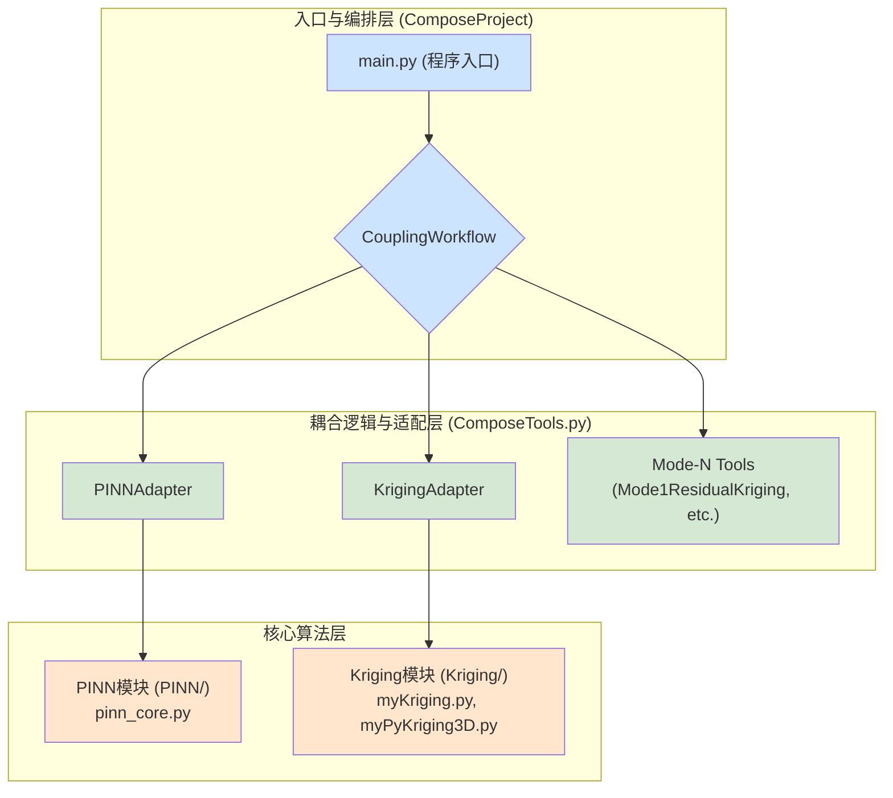

# 项目结构与工作流分析

本文档旨在帮助开发人员快速理解本项目（PINN_ts）的代码结构和核心工作流，以便能高效地进行后续开发。

## 1. 核心思想

本项目的目标是**耦合物理信息神经网络（PINN）与克里金插值（Kriging）**，以解决稀疏数据下的三维物理场重建问题。其核心思路是利用两种方法的优势互补：

*   **PINN**: 擅长利用物理方程（PDEs）作为约束，确保解的物理自洽性，但在数据稀疏区域可能出现欠拟合或过拟合。
*   **Kriging**: 经典的地质统计学方法，擅长根据已知点的空间相关性对未知区域进行插值，能从稀疏数据中提取全局趋势，但本身不包含物理信息。

通过将两者结合，我们期望得到一个既符合物理规律、又与稀疏观测数据吻合的精确解。

## 2. 模块化架构

为了清晰地分离关注点并实现灵活的耦合策略，项目采用了模块化的分层架构。

### 2.1. 核心算法层

这是项目的基础，包含了两个独立的、功能强大的算法模块。

*   **`PINN/` 目录**:
    *   **职责**: 完整的PINN实现。
    *   **关键文件**:
        *   `pinn_core.py`: **PINN的心脏**。`PINNTrainer` 类封装了底层的 `deepxde` 库，定义了网络结构、PDE损失函数、以及核心的训练和预测逻辑。**对PINN模型的任何底层修改都在这里进行**。
        *   `data_processing.py`: 负责数据加载和预处理。`DataLoader` 类提供了从源文件（如Excel）加载数据、采样训练点等标准化功能。
        *   其余文件（`dataAnalysis.py`, `visualization.py` 等）提供了该模块的辅助功能。

*   **`Kriging/` 目录**:
    *   **职责**: Kriging插值算法的实现。
    *   **关键文件**:
        *   `myKriging.py` & `myPyKriging3D.py`: 实现了Kriging算法的核心逻辑，包括变异函数计算、克里金矩阵求解等。特别地，它可能包含了使用CuPy或PyTorch进行GPU加速的实现。

### 2.2. 耦合逻辑与适配层

这是将两个核心算法"粘合"在一起的中间层，也是大部分新耦合策略开发工作发生的地方。

*   **`ComposeProject/ComposeTools.py`**: **新开发人员应首先阅读此文件**。
    *   **职责**: 提供标准化的接口来调用核心算法，并编排不同的耦合策略。
    *   **设计模式**:
        *   **适配器模式 (Adapter Pattern)**: `PINNAdapter` 和 `KrigingAdapter` 是关键。它们为底层的 `PINNTrainer` 和Kriging实现提供了一个统一、简化的接口（如 `.fit()`, `.predict()`）。这使得上层工作流无需关心底层实现的复杂细节，并且未来可以方便地替换底层实现而不影响上层逻辑。
        *   **策略模式 (Strategy Pattern)**: 不同的耦合方案（Mode 1, 2, 3）被封装在各自的工具类中（如 `Mode1ResidualKriging`, `Mode2ROIDetector`, `Mode3PINNTrainer`）。这使得每种方案的逻辑都高度内聚，易于理解和修改。
    *   **关键类**:
        *   `ComposeConfig`: 一个dataclass，集中管理所有耦合方案的超参数，方便调优。
        *   `CouplingWorkflow`: 见下文。

### 2.3. 入口与编排层

这是整个项目的最高层，负责启动和指挥。

*   **`ComposeProject/main.py`**:
    *   **职责**: 整个应用程序的**入口点**。
    *   **工作流程**:
        1.  **解析命令行参数**: 使用 `argparse` 接收用户输入，如选择哪个耦合模式 (`--mode`)、训练周期数等。
        2.  **加载数据**: 调用 `PINN` 模块的 `DataLoader` 准备初始训练数据和预测点。
        3.  **实例化工作流**: 创建 `CouplingWorkflow` 对象。
        4.  **执行工作流**: 根据 `--mode` 参数，调用 `CouplingWorkflow` 中对应的 `run_modeN_pipeline` 方法。
        5.  **评估结果**: 接收工作流返回的预测结果，并使用 `MetricsCalculator` 计算各项性能指标，进行对比和展示。

## 3. 工作流解析：一个请求的生命周期

当用户执行 `python ComposeProject/main.py --mode X` 时，内部发生了什么？

1.  **`main.py`** 捕获请求，准备好通用的 `train_points`, `train_values`, `prediction_points`, 和 `dose_data`。
2.  **`main.py`** 将这些数据传递给 `CouplingWorkflow` 的 `run_modeX_pipeline` 方法。
3.  **`run_modeX_pipeline`** 方法开始执行该模式的特定逻辑。例如，对于 **Mode 3 (终极方案)**：
    a. 它会先实例化 `Mode3KrigingGuided` 工具。
    b. 调用该工具的 `build_kriging_surrogate` 和 `generate_pseudo_data` 方法，得到带权重的伪数据。
    c. 然后实例化 `Mode3PINNTrainer` 工具。
    d. 调用该工具的 `staged_training` 方法，该方法内部会：
        i.  实例化 `PINNAdapter`。
        ii. **第一次**调用 `PINNAdapter.fit_from_memory()` 进行预训练，并将加权的（真实+伪）数据传递给 `PINN/pinn_core.py` 的底层实现。
        iii. **第二次**调用 `PINNAdapter.retrain_with_new_weights()` 进行微调，只更新损失函数权重，然后继续训练。
    e. 最后，`run_mode3_pipeline` 收集最终的预测结果，并为了对比，会单独训练一个基线PINN模型。
4.  **`main.py`** 收到返回的包含 `final_predictions` 和 `pinn_predictions` 的字典。
5.  **`main.py`** 将这些预测结果与真实值进行比较，打印出性能报告。

希望这份文档能帮助您快速上手！ 