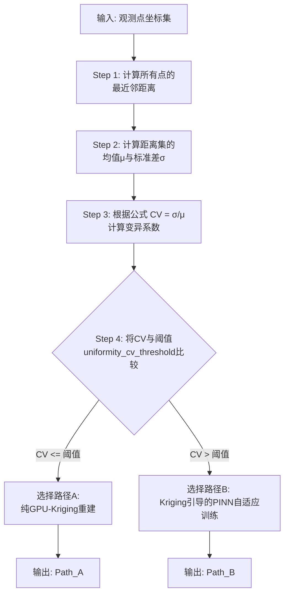

# 3.3 第一层：智能模型选择器

智能模型选择器是本混合计算框架的“决策大脑”，它负责在计算任务开始之初，对输入数据的固有属性进行快速分析，并基于分析结果，为任务规划出最优的计算路径。这一设计直接响应了我们在2.3节中提出的“模型适用性的数据依赖性假设”，旨在将“为不同类型的数据选择最合适模型”这一专家决策过程自动化。

### 3.3.1 选择器工作原理与动机

传统上，研究人员在面对一个物理场重建问题时，会根据经验判断观测数据点的分布情况。如果数据点分布较为均匀，覆盖了大部分求解域，那么计算成本较低的插值方法（如Kriging）通常足以获得满足要求的结果。反之，如果数据点分布稀疏、非均匀，甚至呈现高度聚集的形态，那么缺乏物理先验的纯数据插值方法往往会在数据稀疏的区域产生巨大偏差，此时引入物理方程约束的PINN则成为更可靠的选择。

本选择器的核心动机，就是将上述启发式的判断过程，转化为一个定量的、可重复的自动化流程。它通过计算一个能够反映数据点空间分布模式的统计指标，并将其与预设的阈值进行比较，从而代替人工，以毫秒级的速度完成决策，选择执行效率优先的**路径A（纯GPU-Kriging重建）**，还是精度优先的**路径B（Kriging引导的PINN自适应训练）**。

### 3.3.2 空间分布均匀性的量化指标

为了定量地评估观测数据点的空间分布模式，我们采用了一个在地学和空间统计学中广泛应用的指标——**最近邻距离的变异系数（Coefficient of Variation of Nearest-Neighbor Distances）**。

变异系数是一个无量纲的量，用于衡量一组数据的离散程度。其计算过程如下：

1.  **计算最近邻距离**：对于给定的 `N` 个三维观测数据点 `{p₁, p₂, ..., pₙ}`，我们计算出每个点 `pᵢ` 到其最近的另一个点 `pⱼ` 之间的欧氏距离 `dᵢ`。这样，我们就得到了一个包含 `N` 个距离值的集合 `D = {d₁, d₂, ..., dₙ}`。

2.  **计算统计量**：计算距离集合 `D` 的平均值 `μ` 和标准差 `σ`。
    \[ \mu = \frac{1}{N} \sum_{i=1}^{N} d_i \]
    \[ \sigma = \sqrt{\frac{1}{N-1} \sum_{i=1}^{N} (d_i - \mu)^2} \]

3.  **计算变异系数 (CV)**：将标准差与平均值相除，得到变异系数。
    \[ CV = \frac{\sigma}{\mu} \]

这个CV值能够很好地反映点集的空间分布模式：
*   **CV → 0**：表示所有点之间的最近邻距离都非常接近，趋向于一种完全**均匀、规则**的晶格状分布。
*   **CV ≈ 1**：表示点的分布符合泊松过程，即一种**完全空间随机（Completely Spatial Randomness, CSR）**的模式。
*   **CV > 1**：表示最近邻距离的差异很大，意味着存在大量点相互之间距离很近，而另一些点则离其他所有点都很远，这是一种典型的**聚集（Clustered）**分布模式。

### 3.3.3 决策流程与路径选择

在计算出输入数据点的CV值后，选择器会将其与一个预设的**均匀性阈值 `uniformity_cv_threshold`** 进行比较，以做出最终的路径选择。该阈值是本框架的一个关键超参数，定义于项目的 `config.py` 配置文件中，允许用户根据具体问题进行调整。

决策的完整流程如下图所示，具体步骤分解如下：

*
图3-2 智能模型选择器决策流程图
*

1.  **第一步：计算最近邻距离**。输入 `N` 个三维观测点的坐标，计算每个点到其空间上最近的另一个点的欧氏距离，形成一个包含 `N` 个距离值的集合。
2.  **第二步：计算统计量**。计算该距离集合的算术平均值 `μ` 与标准差 `σ`。
3.  **第三步：计算变异系数**。根据公式 `CV = σ / μ` 计算出最终的量化指标CV值。
4.  **第四步：比较与决策**。将计算出的CV值与预设的阈值 `uniformity_cv_threshold` 进行比较。若CV小于或等于该阈值，则判定数据分布足够均匀，选择路径A；反之，则判定数据分布为稀疏或聚集，需要PINN的物理约束来保证精度，选择路径B。

通过这一系列清晰的步骤，本框架在计算的起始阶段便能“因地制宜”，为不同的数据输入智能地匹配最合适的求解策略，从而为整个框架的自适应性奠定了第一层基础。
